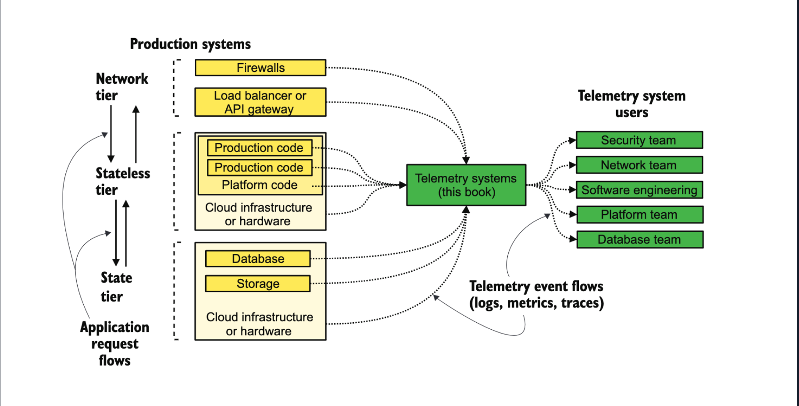

# Grafana Prometheus Workshop

---
transition: slide-up
---

# What is Telemetry?

In a microservice architecture, telemetry often refers to the broader practice of gathering operational data from your services. This can include metrics, logs, and traces, which collectively help you understand how your microservices are performing, how they're interacting, and how data flows between them. Telemetry, therefore, represents a comprehensive monitoring strategy to ensure smooth operation, efficient problem diagnosis, and effective maintenance.
A telemetry system in a microservice architecture might collect data like:

  - Detailed error messages or stack traces
  - Metadata about inter-service communications
  - User behavior data, such as feature usage
<style>
h1 {
  background-color: #2B90B6;
  background-image: linear-gradient(45deg, #7b57c2 10%, #4a279d 20%);
  background-size: 100%;
  -webkit-background-clip: text;
  -moz-background-clip: text;
  -webkit-text-fill-color: transparent;
  -moz-text-fill-color: transparent;
}
</style>
---
transition: slide-left
---

# What are Metrics?

Metrics are a subset of telemetry. In a microservice context, they refer to the specific numerical values that represent the performance, usage, or behavior of each service. Metrics provide quantitative insight into your system, and they are crucial for alerting, dashboard visualization, and capacity planning.
Metrics in a microservice architecture might include:
  - CPU usage per service
  - Memory usage per service
  - Network latency between services
  - Request rate (e.g., requests per second)
  - Error rate
  - Response time

<style>
h1 {
  background-color: #2B90B6;
  background-image: linear-gradient(45deg, #7b57c2 10%, #4a279d 20%);
  background-size: 100%;
  -webkit-background-clip: text;
  -moz-background-clip: text;
  -webkit-text-fill-color: transparent;
  -moz-text-fill-color: transparent;
}
</style>

---
transition: fade-out
---



---
transition: slide-left
---


# What is Grafana?

Grafana is an open-source data visualization and monitoring platform. It provides a flexible and powerful environment 
for creating dashboards, analyzing data, and monitoring systems and applications. Grafana supports a wide range of data sources, 
including popular metrics databases like Prometheus, InfluxDB, and Graphite, as well as various logging systems. 
Some key features and functionalities of Grafana include:
- Data Visualization
- Data Source Integration
- Alerting and Notifications
- Templating and Variables
- Community and Plugins


<style>
h1 {
  background-color: #2B90B6;
  background-image: linear-gradient(45deg, #7b57c2 10%, #4a279d 20%);
  background-size: 100%;
  -webkit-background-clip: text;
  -moz-background-clip: text;
  -webkit-text-fill-color: transparent;
  -moz-text-fill-color: transparent;
}
</style>

---
transition: fade-out
---


---
transition: slide-left
layout: image-right
image: https://www.honeycomb.io/wp-content/uploads/2021/12/blog_hnybyte_app_metrics_w_prometheus_thumbnail.jpg
---

# What is Prometheus?
<br>
Prometheus is an open-source monitoring and alerting toolkit, it is designed to collect, store, and analyze time series data in real-time. 
Time series data refers to a sequence of data points collected at regular intervals over time. Prometheus uses a pull-based model, where it periodically scrapes metrics from various targets such as servers, applications, or other data sources. These metrics are stored in a time series database and can be queried using a flexible query language called Prometheus Query Language.


<style>
h1 {
  background-color: #2B90B6;
  background-image: linear-gradient(45deg, #7b57c2 10%, #4a279d 20%);
  background-size: 100%;
  -webkit-background-clip: text;
  -moz-background-clip: text;
  -webkit-text-fill-color: transparent;
  -moz-text-fill-color: transparent;
}
</style>

---
transition: slide-up
---

# Prometheus Query Language

Prometheus Query Language (PromQL) is a powerful and expressive language used to query and manipulate time series data in Prometheus.
```ts {0|1|1-4}
count(my_metric > 0)

The count() function in PromQL is used to count the number of time series that match a specific condition or filter. 
It returns a scalar value representing the count.
```


```ts {0|1|1-4}
rate(my_metric[5m])

The rate() function in PromQL is used to calculate the per-second average rate of change for a time series. 
It provides a way to measure the rate of increase or decrease of a metric over a specific time window.
```

```ts {0|1|1-5}
sum(rate(my_metric[1h])) by (label_name)

The sum() function operates on each selected time series individually and adds up their respective 
values at each timestamp. It returns a new time series where each data point represents the sum 
of the values from the selected time series.
```


<style>
h1 {
  background-color: #2B90B6;
  background-image: linear-gradient(45deg, #7b57c2 10%, #4a279d 20%);
  background-size: 100%;
  -webkit-background-clip: text;
  -moz-background-clip: text;
  -webkit-text-fill-color: transparent;
  -moz-text-fill-color: transparent;
}
</style>

---
layout: image-right
image: /resources/example_diagram.jpg
transition: slide-left
---

# Example

The main services are:
- Grafana
- Prometheus
- Workshop App

<style>
h1 {
  background-color: #2B90B6;
  background-image: linear-gradient(45deg, #7b57c2 10%, #4a279d 20%);
  background-size: 100%;
  -webkit-background-clip: text;
  -moz-background-clip: text;
  -webkit-text-fill-color: transparent;
  -moz-text-fill-color: transparent;
}
</style>

---
layout: center
class: text-center
transition: slide-up
---

# Play time!

<style>
h1 {
  background-color: #2B90B6;
  background-image: linear-gradient(45deg, #7b57c2 10%, #4a279d 20%);
  background-size: 100%;
  -webkit-background-clip: text;
  -moz-background-clip: text;
  -webkit-text-fill-color: transparent;
  -moz-text-fill-color: transparent;
}
</style>

---
layout: center
class: text-center
---

# Questions

<style>
h1 {
  background-color: #2B90B6;
  background-image: linear-gradient(45deg, #7b57c2 10%, #4a279d 20%);
  background-size: 100%;
  -webkit-background-clip: text;
  -moz-background-clip: text;
  -webkit-text-fill-color: transparent;
  -moz-text-fill-color: transparent;
}
</style>
